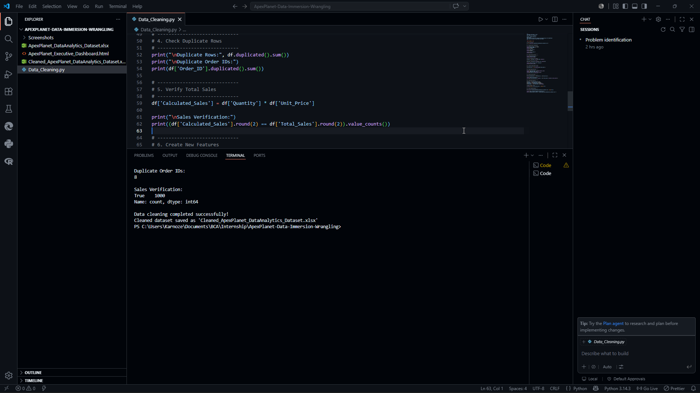

# 📊 Data Immersion & Wrangling

## 📌 Project Overview

The objective of this task is to understand the provided sales dataset, identify data quality issues, clean and transform the data, and prepare an analysis-ready dataset using **Python** and **Pandas**.

---

## 🎯 Objectives

- Understand the dataset structure
- Perform data quality assessment
- Handle missing values
- Check duplicate records
- Convert data types
- Verify data consistency
- Perform feature engineering
- Generate a clean dataset ready for analysis

---

# 🛠 Technologies Used

- Python 3
- Pandas
- OpenPyXL
- Visual Studio Code
- Git & GitHub

---

# 📂 Repository Structure

```
ApexPlanet-Data-Immersion-Wrangling/
│
├── README.md
├── Data_Cleaning.py
├── Data_Dictionary.xlsx
├── Dataset.xlsx
├── Cleaned_Dataset.xlsx
├── Executive_Dashboard.html
│
└── Screenshots/
    ├── Dashboard.png
    ├── MissingValues.png
    └── DuplicateCheck.png
```

---

# 📋 Dataset Information

The dataset contains **1000 sales transactions** with the following fields:

| Column |
|---------|
| Order_ID |
| Order_Date |
| Customer_ID |
| Customer_Name |
| Age |
| Gender |
| City |
| Product |
| Category |
| Quantity |
| Unit_Price |
| Total_Sales |

---

# 📖 Data Dictionary

A detailed **Data Dictionary** describing every column, its data type, description, and business relevance is included in:

**📄 Data_Dictionary.xlsx**

---

# 🧹 Data Cleaning Steps

The following preprocessing steps were performed:

### ✅ Dataset Exploration
- Loaded the dataset
- Displayed dataset shape
- Checked column names
- Verified data types
- Previewed first five records

### ✅ Missing Value Handling
- Filled missing values in **Age** using the **Median**
- Filled missing values in **City** using the **Mode**

### ✅ Date Conversion
- Converted `Order_Date` to DateTime format

### ✅ Duplicate Check
- Checked duplicate rows
- Checked duplicate Order IDs

### ✅ Data Validation
- Verified:

```
Total_Sales = Quantity × Unit_Price
```

### ✅ Feature Engineering

Created new columns:

- Year
- Month
- Quarter
- Day_Name

### ✅ Output

Generated a cleaned dataset:

```
Cleaned_Dataset.xlsx
```

---

# 🚀 How to Run

1. Clone the repository

```
git clone https://github.com/AradhyaMaheshwari-bit/Data-Immersion-Wrangling.git
```

2. Install dependencies

```
pip install pandas openpyxl
```

3. Run

```
python Data_Cleaning.py
```

---

# 📈 Additional Enhancement

As an additional learning exercise beyond the Task 1 requirements, I developed an **Executive Sales Dashboard** using **HTML, CSS, and JavaScript** to visualize the cleaned dataset and present key business insights.

The dashboard includes:

- Revenue KPIs
- Sales Trend
- Category Analysis
- Product Analysis
- Customer Analysis
- City-wise Revenue
- Interactive Filters

Dashboard file:

```
Executive_Dashboard.html
```

---

# 📸 Project Screenshots

## Executive Dashboard


---

## Missing Values Analysis


---

## Duplicate Record Check



---

# 📌 Internship Deliverables

✔ Data Cleaning Script

✔ Data Dictionary

✔ Cleaned Dataset

✔ GitHub Repository

✔ LinkedIn Explanation Video

---

# 👨‍💻 Author

**Aradhya Maheshwari**

Bachelor of Computer Applications (BCA)

Data Analytics & Artificial Intelligence

GitHub:
https://github.com/AradhyaMaheshwari-bit

LinkedIn:
https://www.linkedin.com/in/aradhya-maheshwari/
